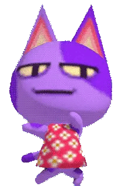
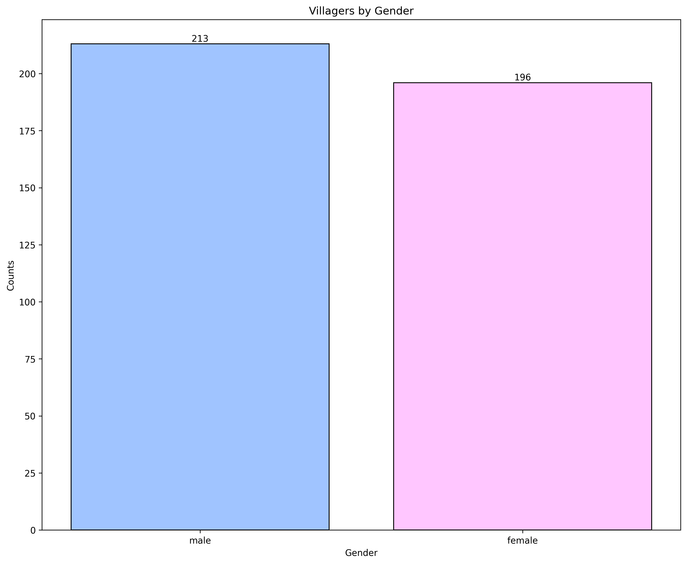
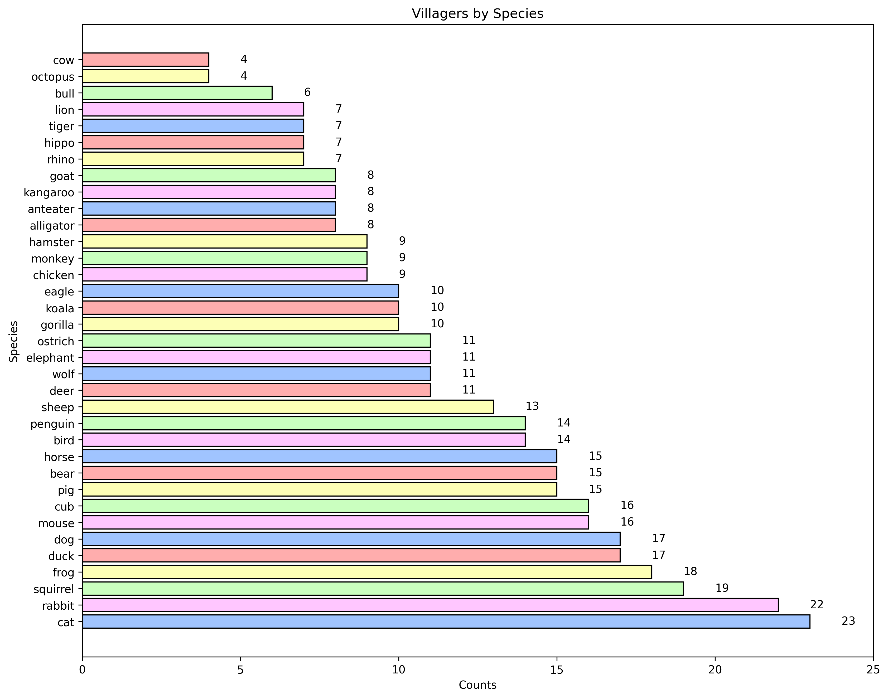
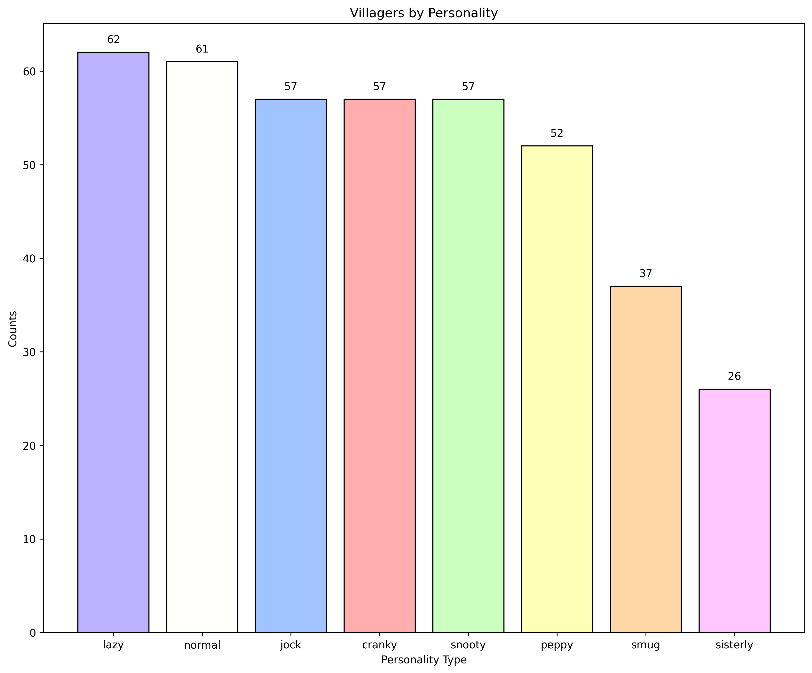
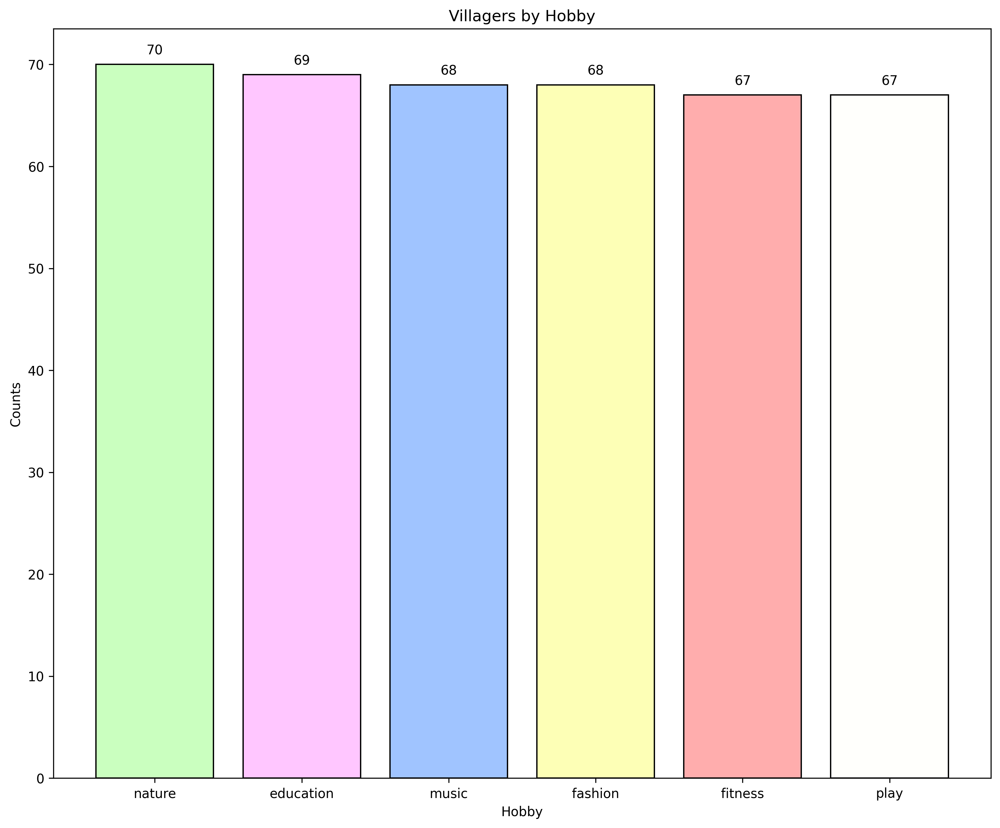
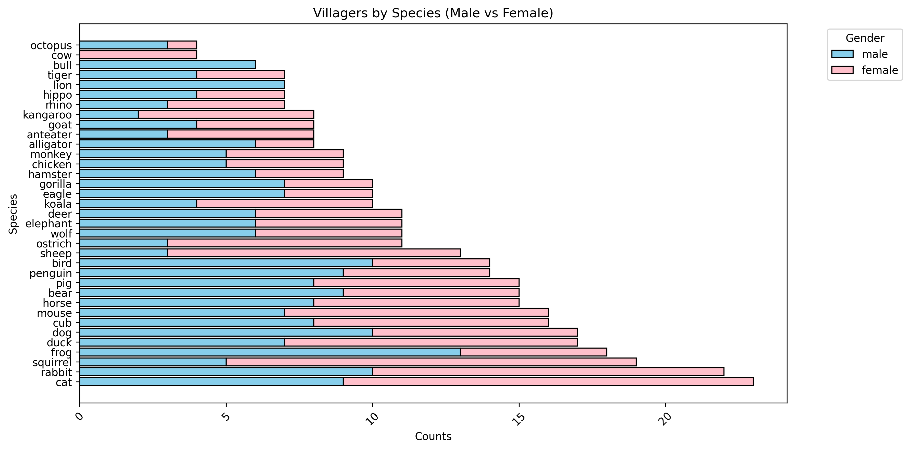
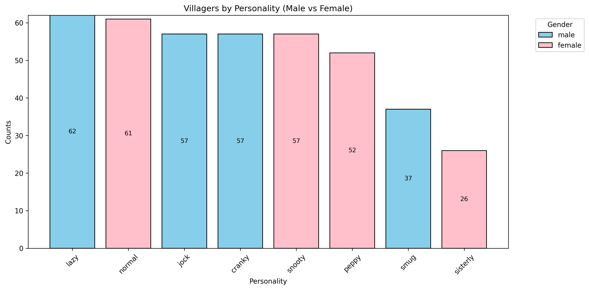
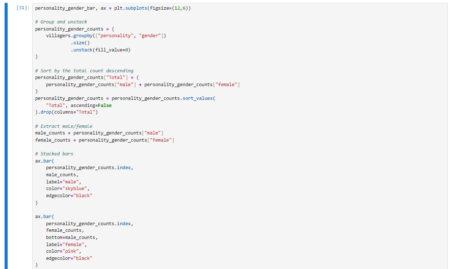
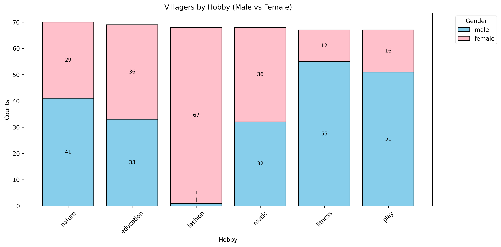
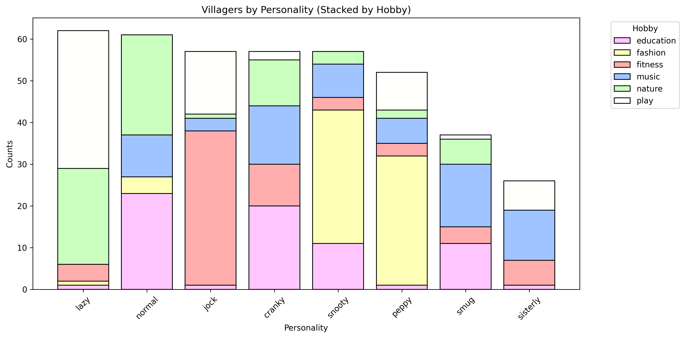

# Animal Crossing Villager Analysis

  
  
  
  
  
</p

This is a simple population analysis project that examines specific aspects of the villagers found in _Animal Crossing: New Horizons_. The population includes any base-game villagers that a player can receive.
This excludes collaboration villagers, such as the Sanrio villagers, as well as upcoming _The Legend of Zelda_ and _Splatoon_ villagers. Special visitors and shopkeeping villagers are also excluded (so no Tom Nook, Able Sisters, Flick, C.J., etc.).

The CSV file used was converted from an Excel sheet I created of the different villagers. All villager information was sourced from the [ACNH Travel Guide app](https://apps.apple.com/us/app/acnh-travel-guide/id1502818559) by Jeffrey.
The collected data includes villagers' names, species, genders, personalities, and hobbies. A copy of the CSV file is included in this repository.

So without further ado, let's look at some charts! 

---
## Visualizations

One thing to note is that since all the data collected is categorical, all charts created for this project are bar charts or variations of bar charts.

### Population Counts

#### Gender

First, we look at the breakdown of the population by gender.

Surprisingly, the gender distribution of the villagers is not as even as I expected, with 17 more male villagers than female villagers. I anticipated a fairly even representation of both genders, but the data suggests otherwise.

#### Species

The next chart shows the number of villagers per animal species, ordered from the fewest to the most.

Cows and octopuses are tied for the fewest villagers, with only four members each. Cats, on the other hand, have the largest representation, with 23 villagers. That's almost six times more than cows or octopuses.
For those hunting for villagers on different mystery islands, this information is useful. When the game generates a villager for a mystery island, it first selects a species, then a specific villager from that species.
This pattern was tested and explained in a Bell Tree Forums post from 2020 by ctar17, which can be found [here](https://www.belltreeforums.com/threads/mystery-island-rng-pattern-solved-with-data-and-stats-tests.511329/).

In practical terms, the more villagers there are in a species, the less likely you are to find a particular villager from that species. If you're looking for a specific cat, rabbit, or squirrel villager, I wish you luck!

#### Personality

The next chart shows the distribution of villager personalities, ordered from the most to the fewest.

Personality distribution is more balanced across the eight types. The lazy personality has the most villagers (62), while sisterly (also known as "big sister") has the fewest (26). This makes sense, as sisterly is the newest personality, introduced in Animal Crossing: New Leaf. Interestingly, despite being the least common, each player in New Horizons starts with a sisterly villager.

#### Hobby

The next chart shows the distribution of villager hobbies, ordered from the most to the fewest.

Hobbies are distributed relatively evenly among villagers. Before collecting data for this project, I hadn’t realized villager hobbies existed, but they are important as they determine daily activities, conversations, and clothing choices. More information about villager hobbies can be found [here](https://animalcrossing.fandom.com/wiki/Hobbies). 

This concludes the charts showing counts of villager attributes. Next, we explore charts comparing species, personality, and hobbies by villager gender.

### Comparison Charts

#### Species Breakdown by Gender

This stacked bar chart displays villager species separated by gender.

Three species are gender-specific: cows, bulls, and lions. All other species include at least one male and one female villager.

#### Personality Breakdown by Gender

This stacked bar chart compares villager personalities by gender.

You might think, "That doesn’t look like a stacked bar chart." It actually is, as shown in the code:

The personality gender comparison chart was my first comparison chart and served as a template for the others. I initially assumed that only the sisterly personality was gender-specific, but it turns out all personalities are gender-specific.
Lazy, jock, cranky, and smug are male; normal, snooty, peppy, and sisterly are female. Therefore, there is no gender split for personalities. The more you know!

#### Hobby Breakdown by Gender

This stacked bar chart compares villager hobbies by gender.

Nature, fitness, and play hobbies are predominantly male, while education, fashion, and music are predominantly female.
Interestingly, there is only one male villager with the fashion hobby: Sasha. Introduced in the _New Horizons_ 2.0 update, he is my favorite villager and currently the only male fashion hobbyist.

#### Personality Breakdown by Hobby

The final chart shows the distribution of personalities by hobby.

One interesting observation is that only the peppy personality includes at least one villager from every hobby. All other personalities have villagers with only four or five of the six hobbies.

---
## Credits

**Author:** Caleb Picone (https://github.com/calebpicone)
Images used were found on https://animalcrossing.fandom.com/wiki/Animal_Crossing_Wiki
